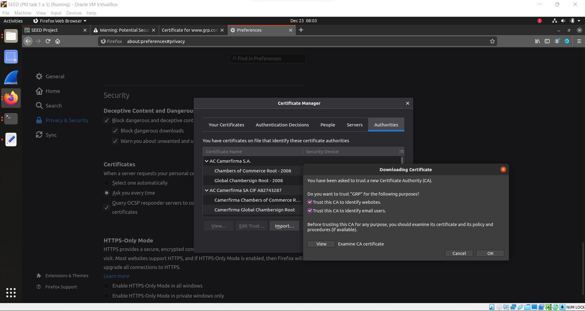

# LOGBOOK11

## Task 1: Becoming a Certificate Authority (CA)

Queremos tornar-nos uma **Certificate Authority (CA)** para podermos emitir um certificado digital para outras pessoas. Neste tarefa, precisámos de copiar o `openssl.cnf` para a nossa pasta PKI para termos o ficheiro de configuração para criar certificados, alterando o conteudo na parte `[CA Default]`:


Depois, precisámos de criar a pasta **demoCA** e adicionar os ficheiros necessários de acordo com os requisitos descritos na ficha.

Com tudo pronto foi criado um "self-signed certificate" para a nossa CA:


Podemos usar os seguintes comandos para ver o conteúdo decodificado do certificado X509 e da chave RSA:
```
openssl x509 -in ca.crt -text -noout
openssl rsa -in ca.key -text -noout
```

Obtendo respetivamente:
---
```
[12/23/22]seed@VM:~/PKI/demoCA$ openssl x509 -in ca.crt -text -noout
Certificate:
    Data:
        Version: 3 (0x2)
        Serial Number:
            0a:c8:f6:d8:22:aa:4c:25:f0:b8:f9:27:69:4e:32:7c:de:37:56:ee
        Signature Algorithm: sha256WithRSAEncryption
        Issuer: C = PT, ST = Porto, L = Porto, O = FEUP, OU = FSI, CN = GRP, emailAddress = some@email.com
        Validity
            Not Before: Dec 23 10:26:11 2022 GMT
            Not After : Dec 20 10:26:11 2032 GMT
        Subject: C = PT, ST = Porto, L = Porto, O = FEUP, OU = FSI, CN = GRP, emailAddress = some@email.com
        Subject Public Key Info:
            Public Key Algorithm: rsaEncryption
                RSA Public-Key: (4096 bit)
                Modulus:
                    00:c1:87:aa:e6:f7:91:6b:94:d9:c8:7f:60:70:fa:
                    11:44:94:b5:8e:80:40:85:9b:e7:da:15:f3:f1:29:
                    0d:ef:cb:fe:c3:14:bb:52:57:cf:85:e9:74:3f:6b:
                    0b:56:ba:94:04:db:a5:f3:87:e9:a3:2f:26:8e:f1:
                    0e:15:63:fb:ba:8a:c5:4d:a5:f5:dc:7f:b3:ee:4b:
                    8a:74:05:08:48:54:b7:2e:c5:f9:bf:e1:6f:10:75:
                    2c:0c:99:45:92:2e:65:d6:b3:26:f9:9f:f1:8a:ec:
                    58:1b:79:5f:b0:86:fa:bf:53:89:c1:9b:09:68:0e:
                    9a:8d:77:4a:a0:42:bc:fb:82:d3:07:71:1f:e9:36:
                    f8:6c:7c:7d:ab:f8:71:3a:d3:38:97:90:7b:2a:0d:
                    3a:d4:4a:64:bc:e4:e8:e3:26:b1:68:9a:b5:b5:c6:
                    d9:41:2a:0f:26:79:e8:c8:a9:1b:87:29:15:ac:5d:
                    42:c5:e2:1b:02:d5:af:e2:4d:da:d8:10:2a:90:ba:
                    86:0b:ab:43:33:0e:52:52:bd:0c:02:60:78:9d:e6:
                    d0:a7:e8:28:14:dd:78:d7:a2:92:ab:86:79:ba:a1:
                    03:59:7f:f6:0d:e0:01:54:34:0d:04:63:a9:f2:39:
                    cc:68:ad:55:21:b8:0b:b8:53:f1:9c:74:08:1e:3b:
                    fb:97:b5:6e:b4:7d:3c:92:e9:c9:cc:6d:73:84:92:
                    24:20:e2:df:d2:2d:f2:30:84:d1:fc:90:0a:54:0f:
                    db:5e:0e:bf:d8:99:c9:f9:41:2e:7a:53:0c:1e:04:
                    a8:0f:f1:2e:45:17:c8:dd:6c:45:92:5e:91:0b:cf:
                    a0:36:28:0a:6f:ea:68:1b:27:74:5e:31:68:48:e9:
                    b4:c9:22:6e:85:d5:f8:ea:3b:e2:e2:f3:eb:4e:98:
                    66:51:04:76:ba:33:f0:74:fa:cf:f5:77:07:c7:bc:
                    1c:4f:8c:31:61:61:ca:07:a4:97:6a:57:35:9f:60:
                    fd:27:ca:4d:c1:71:23:ee:a0:38:13:3a:a4:8a:ce:
                    6f:90:8f:9e:0c:46:42:fd:e1:be:04:ea:1e:8d:85:
                    74:30:e8:32:c5:c5:6e:08:df:3b:f1:b1:a3:f9:b3:
                    fd:04:9d:dd:1a:d0:5d:e8:32:c1:b5:ff:a5:a1:d4:
                    1a:0a:79:12:0a:56:e5:bd:af:0e:fe:f5:e6:24:dd:
                    af:80:52:3d:ef:8c:cf:25:f1:ae:f0:64:9e:1c:8f:
                    0d:68:10:d6:21:9e:17:a9:7f:c2:08:d1:00:ec:bd:
                    f8:23:b3:18:98:61:6b:11:54:34:9e:32:fa:73:97:
                    86:46:75:06:c0:dc:8b:3d:d3:57:2b:db:5a:85:b7:
                    b9:76:69
                Exponent: 65537 (0x10001)
        X509v3 extensions:
            X509v3 Subject Key Identifier: 
                CD:15:B8:72:00:44:0E:A4:C7:98:A9:AB:E0:4B:89:FD:F0:5D:39:39
            X509v3 Authority Key Identifier: 
                keyid:CD:15:B8:72:00:44:0E:A4:C7:98:A9:AB:E0:4B:89:FD:F0:5D:39:39

            X509v3 Basic Constraints: critical
                CA:TRUE
    Signature Algorithm: sha256WithRSAEncryption
         02:f5:4b:d8:72:2a:c1:6d:bb:3c:39:46:37:af:65:e8:45:0b:
         dc:50:e3:c4:b5:9a:3e:3d:20:f5:f9:16:9e:3c:e7:7e:d6:bb:
         58:62:0f:32:31:24:19:1b:8a:3c:21:ec:9f:3e:a0:07:5b:c1:
         bc:72:9e:0d:e6:48:71:b5:dc:8c:b0:7a:d1:ad:19:76:67:36:
         9c:6c:d8:1f:52:1e:28:ba:7b:ca:c6:73:a2:c8:b3:fe:25:2e:
         db:43:e2:3f:ac:29:15:c2:25:2e:b7:30:cc:43:27:92:64:34:
         ff:a9:44:db:4f:fa:c9:55:18:92:84:51:ae:78:3e:cc:46:d8:
         51:43:db:49:5f:90:1c:fc:39:9a:c2:67:b5:7a:a8:d6:05:70:
         95:5f:5b:61:d8:89:1f:47:61:d7:50:ad:fc:04:5b:8a:5d:d0:
         db:77:7e:0a:c1:bc:af:b4:b5:6f:17:ac:fe:99:71:36:82:2a:
         64:a5:03:c2:08:7c:5d:82:12:93:a6:1a:7d:f9:18:ed:3d:cc:
         3b:5b:fa:b2:e5:3c:17:c3:cb:ed:f7:27:66:ac:53:0d:55:7e:
         d7:7e:10:56:19:b0:ca:69:b7:4e:b6:b0:fd:90:2b:f6:0c:99:
         85:95:2b:d4:22:7f:a6:d7:50:de:54:f7:9c:cd:6f:5d:02:7d:
         cd:55:f1:a9:b9:f7:b4:bd:07:d9:e0:ad:87:70:c7:d5:e0:8f:
         d4:20:b2:dc:2a:5d:47:4c:d0:5f:d9:0c:e3:a0:76:ef:7e:70:
         8b:6f:33:6c:34:73:9f:6e:13:dd:bb:53:ad:05:49:db:f2:00:
         82:0e:b0:07:d4:46:73:72:cd:c1:f7:d9:13:53:cb:d9:d0:c6:
         9d:f4:fb:af:ca:fe:32:35:6f:2a:dc:49:e7:40:40:71:a9:f6:
         2f:9b:c2:3d:97:28:57:2c:25:f9:52:3f:0b:a6:28:6d:57:31:
         6f:87:e4:89:fe:7d:eb:a1:dc:e1:ed:ff:58:fb:17:c8:15:5d:
         bb:f2:a7:e6:83:e1:97:ba:ad:7b:32:e4:35:bf:86:ed:7c:d3:
         67:57:26:25:ef:02:a7:d9:8b:53:a6:1a:c5:71:d5:48:36:6f:
         bf:40:ed:73:69:b9:0b:28:a8:d1:aa:0b:38:06:d9:31:56:00:
         d1:2b:fc:40:54:15:3e:67:cf:3b:db:2d:91:be:dc:5b:d4:3c:
         ad:e2:b3:87:6e:b4:a2:ad:c1:44:64:10:2d:ec:e5:07:ba:7f:
         e7:54:08:e0:dc:c2:3b:53:3c:18:6f:91:57:20:b8:0d:da:bb:
         61:7d:bf:5f:4a:8c:b6:25:ce:55:1d:e8:eb:3c:cd:2d:fa:01:
         55:86:d7:fa:51:7b:8d:b9
```
---

```
[12/23/22]seed@VM:~/PKI/demoCA$ openssl rsa -in ca.key -text -noout
Enter pass phrase for ca.key:
RSA Private-Key: (4096 bit, 2 primes)
modulus:
    00:c1:87:aa:e6:f7:91:6b:94:d9:c8:7f:60:70:fa:
    11:44:94:b5:8e:80:40:85:9b:e7:da:15:f3:f1:29:
    0d:ef:cb:fe:c3:14:bb:52:57:cf:85:e9:74:3f:6b:
    0b:56:ba:94:04:db:a5:f3:87:e9:a3:2f:26:8e:f1:
    0e:15:63:fb:ba:8a:c5:4d:a5:f5:dc:7f:b3:ee:4b:
    8a:74:05:08:48:54:b7:2e:c5:f9:bf:e1:6f:10:75:
    2c:0c:99:45:92:2e:65:d6:b3:26:f9:9f:f1:8a:ec:
    58:1b:79:5f:b0:86:fa:bf:53:89:c1:9b:09:68:0e:
    9a:8d:77:4a:a0:42:bc:fb:82:d3:07:71:1f:e9:36:
    f8:6c:7c:7d:ab:f8:71:3a:d3:38:97:90:7b:2a:0d:
    3a:d4:4a:64:bc:e4:e8:e3:26:b1:68:9a:b5:b5:c6:
    d9:41:2a:0f:26:79:e8:c8:a9:1b:87:29:15:ac:5d:
    42:c5:e2:1b:02:d5:af:e2:4d:da:d8:10:2a:90:ba:
    86:0b:ab:43:33:0e:52:52:bd:0c:02:60:78:9d:e6:
    d0:a7:e8:28:14:dd:78:d7:a2:92:ab:86:79:ba:a1:
    03:59:7f:f6:0d:e0:01:54:34:0d:04:63:a9:f2:39:
    cc:68:ad:55:21:b8:0b:b8:53:f1:9c:74:08:1e:3b:
    fb:97:b5:6e:b4:7d:3c:92:e9:c9:cc:6d:73:84:92:
    24:20:e2:df:d2:2d:f2:30:84:d1:fc:90:0a:54:0f:
    db:5e:0e:bf:d8:99:c9:f9:41:2e:7a:53:0c:1e:04:
    a8:0f:f1:2e:45:17:c8:dd:6c:45:92:5e:91:0b:cf:
    a0:36:28:0a:6f:ea:68:1b:27:74:5e:31:68:48:e9:
    b4:c9:22:6e:85:d5:f8:ea:3b:e2:e2:f3:eb:4e:98:
    66:51:04:76:ba:33:f0:74:fa:cf:f5:77:07:c7:bc:
    1c:4f:8c:31:61:61:ca:07:a4:97:6a:57:35:9f:60:
    fd:27:ca:4d:c1:71:23:ee:a0:38:13:3a:a4:8a:ce:
    6f:90:8f:9e:0c:46:42:fd:e1:be:04:ea:1e:8d:85:
    74:30:e8:32:c5:c5:6e:08:df:3b:f1:b1:a3:f9:b3:
    fd:04:9d:dd:1a:d0:5d:e8:32:c1:b5:ff:a5:a1:d4:
    1a:0a:79:12:0a:56:e5:bd:af:0e:fe:f5:e6:24:dd:
    af:80:52:3d:ef:8c:cf:25:f1:ae:f0:64:9e:1c:8f:
    0d:68:10:d6:21:9e:17:a9:7f:c2:08:d1:00:ec:bd:
    f8:23:b3:18:98:61:6b:11:54:34:9e:32:fa:73:97:
    86:46:75:06:c0:dc:8b:3d:d3:57:2b:db:5a:85:b7:
    b9:76:69
publicExponent: 65537 (0x10001)
privateExponent:
    71:0f:a0:31:44:ea:a8:ee:11:f9:47:29:01:77:a6:
    44:e9:97:d3:c3:6b:6e:62:f1:a5:7f:f3:be:ac:dc:
    5e:7e:4f:bc:8a:4d:11:43:09:92:d3:1b:3d:bd:7c:
    a7:53:63:0c:1f:82:28:ee:fa:f8:81:a0:46:1b:df:
    bd:71:66:eb:c9:0c:91:5b:66:72:46:0c:c9:27:4a:
    a0:93:1c:0e:9d:a7:52:e5:08:0e:28:56:69:47:fa:
    ce:f5:70:26:81:82:af:56:84:6b:8b:1c:62:ab:c6:
    a1:6e:5c:0f:d6:1b:81:50:fd:86:a4:db:6e:f6:31:
    26:7a:4d:97:a8:c5:9d:2e:05:b9:30:46:93:49:b1:
    02:38:0c:77:3e:32:70:4a:5b:a2:78:1e:ec:27:44:
    7a:27:68:08:ce:b6:9b:95:cc:49:2f:30:ff:1c:47:
    6a:01:77:4e:64:24:31:ae:51:cd:b9:9b:d6:d1:b9:
    23:bf:ff:45:bd:ae:fe:47:bb:95:44:84:89:7e:de:
    b6:cc:7b:fa:c4:e0:25:44:1a:52:fd:27:1a:20:71:
    3f:d6:aa:2b:de:63:2d:9e:e5:8e:dd:86:1a:18:dc:
    cb:19:ad:96:d7:8a:0f:36:45:70:8e:05:07:e4:ea:
    5d:30:fe:2e:2f:c6:71:0e:61:75:a4:77:e5:a9:e7:
    45:ea:fe:43:a7:f0:a5:a9:03:cb:27:36:c8:d1:ea:
    52:40:f6:c2:a9:01:22:64:ba:7b:e5:78:f3:10:29:
    94:f4:6c:0b:e6:29:20:86:4f:bc:be:84:7c:f4:3d:
    b0:11:34:90:64:fc:d4:cb:4b:fd:ec:cd:1b:9c:1a:
    b0:81:09:d2:ec:d2:2e:8e:ee:bf:b7:6f:7a:38:5d:
    2c:38:d0:d7:7b:4a:25:c5:41:a9:9d:0c:dd:10:5e:
    33:b1:78:fb:60:4b:f0:f1:94:4a:6a:6c:88:ba:ed:
    93:13:47:2b:d0:1b:52:c0:a3:e4:f5:dc:04:8f:be:
    2a:74:c3:10:31:dc:55:da:5f:e4:03:ff:7c:9b:99:
    12:4c:1e:ff:f7:79:c4:7c:13:22:f0:14:a7:3e:4b:
    45:1f:d4:5e:0c:a4:8c:a2:16:8c:08:1c:67:2e:01:
    03:df:6c:e6:c5:1d:c1:2e:b2:42:23:2d:c3:ef:a9:
    5e:b8:8b:01:20:32:1f:3c:c9:cf:ee:ca:78:46:7e:
    41:8b:79:3b:de:aa:62:95:66:be:0f:cc:47:a1:f1:
    d1:79:ab:86:d7:39:62:11:90:f8:16:31:69:b0:97:
    00:34:3a:a2:a6:10:f9:ef:b7:ef:cd:26:7e:1a:63:
    1c:8b:55:bb:62:91:ad:c2:5e:e4:54:2e:35:a8:2a:
    38:b1
prime1:
    00:df:ba:e9:dd:9d:72:6a:00:df:5c:aa:63:f6:86:
    f3:6f:a1:28:fa:a0:31:e6:1d:44:49:15:ad:71:fd:
    c5:77:61:09:8d:38:6e:8d:aa:2c:29:79:fe:0b:4d:
    23:7b:4d:74:28:93:dc:cb:3e:16:24:a4:5e:3c:07:
    bd:8b:2e:e3:ca:49:85:64:4e:38:34:a4:f4:bc:67:
    09:82:d4:2c:cd:3c:60:93:02:f8:d5:72:1b:ed:9e:
    94:5c:70:7c:3e:a6:f4:68:88:3d:d0:9e:d8:b9:0d:
    af:47:81:c5:d2:0b:8b:1f:28:22:1a:b1:dc:0e:94:
    0a:0d:a9:83:b9:8f:f9:e3:44:81:63:32:2a:3e:e9:
    03:99:b6:33:91:26:8e:7b:74:1f:e3:f3:8e:b4:7b:
    d3:bf:c3:51:fa:8e:1a:ee:68:45:cd:e5:23:5b:f4:
    b5:88:dd:98:00:0c:e2:cf:80:3f:d7:79:2c:f0:56:
    b8:67:0d:b0:80:dc:7b:08:25:34:0d:69:47:54:ec:
    a6:e6:87:37:e3:ff:de:44:35:fd:3f:dc:a0:02:e9:
    09:8b:02:1e:44:f0:ff:4b:4b:c2:f7:bf:b3:f5:8e:
    64:a2:e3:6b:5d:ae:5a:e8:7e:42:b2:fe:3f:35:ac:
    83:1d:6c:df:42:4c:12:b8:5a:3b:89:46:7b:e1:28:
    20:c5
prime2:
    00:dd:71:a1:ea:6b:70:00:85:4a:e5:1c:62:af:2f:
    17:ab:bc:d2:45:01:cd:79:eb:22:c3:9f:a1:63:1f:
    2c:c7:da:5e:c8:b5:6a:87:c2:77:c6:c7:4e:0e:e1:
    82:d1:24:7d:c5:cd:bf:29:84:dc:00:b8:ff:1d:75:
    93:e6:c9:4b:3c:a4:87:ac:64:b1:dd:4a:01:e7:0f:
    a0:e4:a1:de:31:17:4d:ef:3e:da:d2:96:41:89:36:
    87:7b:66:e3:2e:b8:7e:71:11:48:ad:c0:78:5f:81:
    d4:ea:e4:b7:77:eb:73:f8:3a:6a:7a:92:1f:57:49:
    6a:35:85:3e:55:2f:54:16:57:c6:7a:2b:40:21:9e:
    1d:2f:06:6c:2d:a2:59:78:2b:a3:8b:14:f1:10:15:
    f7:dd:aa:56:f9:6a:12:fa:93:06:ee:e3:80:d4:5b:
    64:ec:61:4c:25:65:8d:84:c5:7a:51:d1:1d:1b:c9:
    29:71:da:ab:a4:63:6f:a8:8b:5c:fe:78:42:0e:93:
    fa:50:0c:10:f8:35:53:45:ee:a8:e5:12:a2:c2:25:
    07:43:42:49:9a:72:c7:bd:24:db:06:cc:7e:0f:5e:
    e0:2f:98:30:21:e6:d9:92:a9:3f:ab:b9:aa:c8:e7:
    e2:93:ea:b0:05:72:ce:07:fc:df:b7:cb:43:ee:eb:
    91:55
exponent1:
    68:1c:51:b1:d8:0f:a2:f6:6e:fa:6f:2b:ff:4f:83:
    3e:c2:0f:10:b9:b5:1e:b1:25:d2:a0:ac:ca:ab:dd:
    d5:14:a9:de:36:91:73:88:e9:ee:0f:1f:c1:e0:8e:
    8f:55:56:a5:7f:51:32:9e:dc:ad:06:73:f7:99:5e:
    81:c3:3b:2b:2a:15:51:bc:f8:78:be:fe:48:21:e6:
    92:23:ec:09:41:7c:6b:4c:e9:c0:61:ce:4f:40:09:
    28:0f:0c:32:17:7d:0a:9b:c3:b0:2e:0b:09:ea:2d:
    53:a8:37:06:ec:6a:3c:00:70:06:5e:17:da:0c:d7:
    b4:cd:da:47:62:91:55:49:ce:af:fb:6b:1f:45:4d:
    70:9d:11:d8:0c:ca:26:f6:bd:d4:54:c5:66:85:6c:
    df:02:a4:46:65:14:71:36:c2:ac:f2:61:06:ec:94:
    01:71:a4:c6:f9:38:1e:79:3e:bc:25:5e:5d:24:ed:
    c0:be:e5:10:c2:08:da:9c:7d:61:74:49:46:62:ad:
    b3:fe:de:6a:51:e9:fb:71:e8:3c:6c:8d:65:6d:4e:
    0c:8a:da:cd:18:1c:a4:cc:47:99:04:73:58:e4:7f:
    3e:31:78:07:eb:17:d0:b2:d8:94:f4:ad:33:6b:e8:
    c3:ab:a3:24:f5:c3:8c:58:28:f6:53:7f:58:22:55:
    45
exponent2:
    00:b3:49:de:43:52:cb:32:d0:b8:ab:b9:08:b9:37:
    92:9d:ac:5a:3e:1e:d0:83:26:7a:56:12:77:73:2e:
    79:6e:32:02:4d:d4:7c:35:00:a1:43:62:78:73:99:
    e7:f5:76:eb:11:ec:9c:1a:7c:84:37:5d:90:c8:04:
    3b:44:3e:b3:d8:9c:89:70:6d:72:88:6c:f4:0f:64:
    da:ea:61:97:e8:fd:2a:4f:4a:ff:96:42:ab:3a:f1:
    d8:4d:74:26:f9:db:cc:1b:b5:57:b7:bd:be:77:ed:
    41:3b:11:04:ee:65:c6:d6:32:4d:a5:81:8b:38:7b:
    ab:2f:3b:fb:14:b3:26:0c:94:f2:90:55:56:2e:21:
    bb:15:28:c9:0b:45:87:d4:c0:d8:3f:b2:2b:de:cf:
    3a:88:d0:f2:6c:2b:92:c4:27:a8:14:60:44:1d:2b:
    06:12:50:50:7b:72:b6:5a:ca:1c:58:03:cb:e2:84:
    43:36:f8:49:c1:e5:f4:30:6c:ed:54:e6:7e:ed:18:
    a8:30:89:24:70:21:94:93:69:40:7b:7f:54:21:86:
    23:54:34:66:2d:53:43:1e:83:a9:85:de:a9:2d:be:
    ae:1a:3a:c8:b5:9a:17:8c:23:d5:f6:2e:73:f5:07:
    b1:ad:fa:f4:9a:e4:b1:a5:4b:fa:c1:ef:23:c8:5c:
    17:a5
coefficient:
    00:b6:92:58:fd:3b:dd:1c:f5:d5:0c:63:1a:75:21:
    32:f8:1f:43:b8:49:92:c8:87:8e:dc:3a:0c:12:82:
    90:9e:a4:7b:61:4b:d2:3b:cb:28:c8:28:80:51:b7:
    0e:dd:cd:b4:e5:0c:de:de:81:ee:6a:b9:ad:53:f6:
    38:7a:7a:44:33:84:1d:4e:13:43:22:a1:26:ff:d9:
    3d:e6:55:a4:b8:63:3d:56:67:54:db:61:c0:61:4d:
    72:9a:34:0d:2c:ab:b1:3f:d3:ea:00:a7:3d:4e:13:
    be:72:ed:1d:3c:e7:94:25:f4:44:18:3b:40:0f:db:
    17:01:b4:e8:de:16:4d:43:f9:de:23:c2:32:fa:06:
    8f:e3:a4:1e:42:c7:b1:a1:7b:3b:54:15:3f:fb:3d:
    28:3d:fe:c0:31:80:a3:96:86:3f:42:13:56:6c:90:
    d7:05:25:a4:c3:4f:8c:8c:20:0e:0f:cb:8b:0e:0b:
    2e:e7:77:c8:94:8f:1b:c9:08:56:0b:e7:73:ec:34:
    3a:6f:de:71:16:5b:07:5f:3d:18:31:50:8a:10:33:
    42:80:61:8f:cb:6e:d8:c1:9e:cc:a7:75:20:b1:fa:
    23:c9:87:ec:78:b8:db:9c:12:61:1b:ef:11:bd:0f:
    8e:80:10:f2:6d:ce:8d:c3:26:1a:e6:24:88:72:eb:
    df:54
```
---

### What part of the certificate indicates this is a CA’s certificate?
A parte do certificado que indica que é um certificado de CA é o campo "Basic Constraints", que especifica se o certificado é ou não um certificado de CA. Se o valor do campo "CA" for "TRUE", isso indica que o certificado é de uma CA.


### What part of the certificate indicates this is a self-signed certificate?
A parte do certificado que indica que é um certificado autoassinado é o campo "Subject" e o campo "Issuer". Se o valor do campo "Subject" for igual ao valor do campo "Issuer", isso indica que o certificado é autoassinado, pois o assunto (Subject) e o emissor (Issuer) são a mesma entidade.


### In the RSA algorithm, we have a public exponent e, a private exponent d, a modulus n, and two secret numbers p and q, such that n = pq. Please identify the values for these elements in your certificate and key files.
Os elementos público "e", expoente privado "d", módulo "n" e os números secretos "p" e "q" são os seguintes:

- e: publicExponent
- d: privateExponent
- n: modulus
- p: prime1
- q: prime2

## Task 2

Para realizar esta tarefa, utilizámos o seguinte comando para gerar uma CSR para **ww.grp.com**:

```
openssl req -newkey rsa:2048 -sha256 -keyout server.key -out server.csr \
-subj "/CN=www.grp.com/O=grp Inc./C=US" \
-passout pass:dees 
``` 

Depois seguimos os seguintes comandos:
```
openssl req -in server.csr -text -noout
openssl rsa -in server.key -text -noout

```

Obtendo:
```
[12/23/22]seed@VM:~/PKI$ openssl req -in server.csr -text -noout
Certificate Request:
    Data:
        Version: 1 (0x0)
        Subject: CN = www.grp.com, O = GRP Inc., C = US
        Subject Public Key Info:
            Public Key Algorithm: rsaEncryption
                RSA Public-Key: (2048 bit)
                Modulus:
                    00:d1:9f:c3:e3:e6:ee:90:30:e4:d2:3b:1c:7f:3a:
                    08:76:7b:fc:c7:b5:a7:3c:55:9c:1d:5a:bd:d6:eb:
                    bd:28:9d:54:cd:37:98:e9:c5:27:85:23:b1:fd:47:
                    07:06:f0:30:63:06:13:f0:7f:dd:78:78:f9:b9:3c:
                    3d:c5:37:ef:9f:4e:d1:bb:8b:a3:d8:f2:36:55:26:
                    da:a9:69:7f:69:5c:ce:8c:df:83:d2:8f:c2:d1:b9:
                    6e:da:30:e0:89:71:e8:69:e0:a4:39:bb:87:cf:66:
                    8f:51:aa:b8:da:3d:47:48:83:e4:bb:2f:0c:dc:e4:
                    13:4f:25:99:97:29:11:2f:ba:33:86:cb:a9:85:3a:
                    76:b5:0c:86:6e:71:d2:09:00:48:a9:92:8c:97:0d:
                    59:16:83:e6:25:73:c7:70:a2:b2:02:bc:61:f8:4f:
                    59:47:83:df:7c:1a:ba:fc:0b:61:ee:01:fe:8f:21:
                    81:b3:f9:7d:c8:ef:91:f1:a6:72:b9:78:37:b9:bf:
                    0c:45:25:ae:7a:61:5b:e7:69:53:cf:df:8f:d9:d7:
                    3d:48:db:b3:0b:b8:53:f5:51:8f:f8:89:53:4c:82:
                    b4:9e:48:01:61:97:28:55:2a:4a:4b:f5:0d:e6:2b:
                    87:c0:74:b2:df:5d:75:4b:f7:d7:2f:ef:eb:b3:4b:
                    92:0b
                Exponent: 65537 (0x10001)
        Attributes:
            a0:00
    Signature Algorithm: sha256WithRSAEncryption
         bc:31:93:3a:ac:53:69:e3:55:92:b9:92:66:b1:a5:42:e6:87:
         75:06:9a:b0:c9:42:c9:42:76:93:f3:ca:65:1a:c8:af:89:c3:
         43:4f:f1:fe:d1:03:50:9a:5a:3b:1c:09:82:0e:6e:05:50:20:
         6d:93:88:8b:8d:9a:74:70:89:01:74:28:6f:cd:29:df:f7:5a:
         41:e1:40:45:9c:29:45:69:7d:b0:56:d8:c7:93:07:58:5b:fa:
         fc:2c:35:3d:b5:ce:2e:ab:8c:36:31:fb:18:18:4e:74:16:5e:
         87:3f:84:a6:2d:51:9e:64:cf:e9:01:2f:e4:0d:51:99:66:fd:
         4e:a9:82:e1:94:f3:fb:88:85:6b:c8:c9:2c:76:bb:13:75:22:
         93:ee:2b:c6:9d:f4:b0:7a:82:54:c0:eb:cf:78:1a:7d:25:2a:
         7e:e8:e3:26:c4:55:85:49:60:31:9c:5f:a7:d8:dd:04:7d:f3:
         c6:d5:1f:18:8b:e5:85:af:63:d2:61:8e:e9:97:94:09:cc:a0:
         e8:b9:56:92:58:1e:f7:c2:b4:08:72:6a:5e:aa:ce:f3:fb:e7:
         a8:51:bc:20:15:b4:44:61:a6:c3:a0:fe:07:94:29:1f:d1:a5:
         8f:5c:fa:be:17:63:7e:e4:ed:64:0c:5c:bf:24:28:0f:9c:3b:
         f9:9f:e4:97
```
```
[12/23/22]seed@VM:~/PKI$ openssl rsa -in server.key -text -noout
Enter pass phrase for server.key:
RSA Private-Key: (2048 bit, 2 primes)
modulus:
    00:d1:9f:c3:e3:e6:ee:90:30:e4:d2:3b:1c:7f:3a:
    08:76:7b:fc:c7:b5:a7:3c:55:9c:1d:5a:bd:d6:eb:
    bd:28:9d:54:cd:37:98:e9:c5:27:85:23:b1:fd:47:
    07:06:f0:30:63:06:13:f0:7f:dd:78:78:f9:b9:3c:
    3d:c5:37:ef:9f:4e:d1:bb:8b:a3:d8:f2:36:55:26:
    da:a9:69:7f:69:5c:ce:8c:df:83:d2:8f:c2:d1:b9:
    6e:da:30:e0:89:71:e8:69:e0:a4:39:bb:87:cf:66:
    8f:51:aa:b8:da:3d:47:48:83:e4:bb:2f:0c:dc:e4:
    13:4f:25:99:97:29:11:2f:ba:33:86:cb:a9:85:3a:
    76:b5:0c:86:6e:71:d2:09:00:48:a9:92:8c:97:0d:
    59:16:83:e6:25:73:c7:70:a2:b2:02:bc:61:f8:4f:
    59:47:83:df:7c:1a:ba:fc:0b:61:ee:01:fe:8f:21:
    81:b3:f9:7d:c8:ef:91:f1:a6:72:b9:78:37:b9:bf:
    0c:45:25:ae:7a:61:5b:e7:69:53:cf:df:8f:d9:d7:
    3d:48:db:b3:0b:b8:53:f5:51:8f:f8:89:53:4c:82:
    b4:9e:48:01:61:97:28:55:2a:4a:4b:f5:0d:e6:2b:
    87:c0:74:b2:df:5d:75:4b:f7:d7:2f:ef:eb:b3:4b:
    92:0b
publicExponent: 65537 (0x10001)
privateExponent:
    20:80:25:ce:02:f2:ff:f6:24:b4:17:a8:1e:6d:af:
    fc:36:d3:05:5f:bb:b3:16:0e:e3:5a:3b:4e:c4:34:
    0a:c5:01:ed:e3:6d:d8:e8:d1:6c:ca:11:01:94:ee:
    98:fb:ca:74:bf:ef:7d:7d:45:a8:35:11:7a:cf:c5:
    3f:fb:a1:32:50:f5:21:9f:cf:e2:86:03:38:86:92:
    a6:6b:8d:ee:97:0e:0b:37:68:67:d0:14:43:91:fd:
    86:e4:c7:1b:68:46:c1:8b:ab:ca:ab:b1:ad:cd:57:
    f1:30:88:02:86:37:b4:1d:86:ec:22:aa:5a:e1:1d:
    c1:4a:b2:1a:86:aa:7c:7c:99:34:7e:24:08:a5:6f:
    a2:ca:f2:3d:cc:46:68:8c:34:c7:71:d6:41:4e:93:
    d2:66:81:38:33:3b:b8:b9:d4:7c:f6:a1:14:4e:3c:
    ae:81:8b:cb:2a:3a:c6:c3:eb:13:0a:70:1a:2f:bb:
    ce:5d:1a:00:fc:fb:ad:fe:12:2d:c8:89:46:ab:5b:
    cc:31:ae:93:f4:fd:ec:f7:b2:4e:22:a4:60:5d:0b:
    14:10:a0:3d:c1:db:4e:31:d9:d6:18:d2:11:64:53:
    4a:94:57:f9:e3:7a:53:32:79:5d:c4:2e:33:1a:3e:
    af:21:f3:c0:fd:17:0d:72:ea:b0:e3:8f:45:e3:15:
    d1
prime1:
    00:f1:bc:a6:ca:a7:93:8d:37:86:8c:75:af:2f:84:
    16:e5:ad:22:0e:7d:8b:bf:88:c6:fe:cc:78:24:a7:
    7d:b8:b4:91:2c:ad:54:29:c0:56:c3:15:cb:6c:4c:
    a6:28:8b:fb:2f:56:47:05:e7:cc:ef:1c:18:18:f4:
    6b:89:88:08:9c:bb:a6:e3:48:30:05:19:f7:95:3f:
    05:8c:53:79:88:d0:bf:f5:fc:20:02:04:55:62:b1:
    cf:f4:e6:98:34:7c:66:6e:bd:79:03:97:89:04:1a:
    8c:4e:27:83:55:de:dd:b5:16:ca:19:d3:87:05:76:
    7f:1f:01:77:51:01:32:55:13
prime2:
    00:dd:fe:0f:97:df:9a:f6:7c:1f:7c:21:dd:4f:7b:
    a6:5c:85:1a:76:1c:01:34:c0:65:43:16:75:5a:13:
    67:4e:23:d6:db:39:83:76:5b:1b:03:8a:42:f6:ae:
    6b:a7:1a:fd:a2:96:4d:b2:97:c5:a7:7d:46:69:6b:
    6f:c3:ae:af:31:cd:06:62:e5:64:0b:3d:9a:fb:cb:
    31:55:4f:2d:0c:d4:7f:ec:bf:9a:0c:a0:3c:ff:85:
    bd:03:66:ba:c5:9e:97:f5:c9:a3:91:45:72:21:f1:
    c9:07:25:70:2e:d0:17:88:ce:fd:09:63:b1:c0:b8:
    2b:d9:10:a8:ec:49:fc:86:29
exponent1:
    60:f9:d0:63:8e:14:68:5b:75:13:96:06:80:66:5a:
    15:2b:7e:75:17:b2:5f:55:0c:97:9d:09:39:93:23:
    a1:5c:76:bc:d8:8f:e1:eb:f2:22:72:f4:d7:6e:6c:
    5d:e9:c2:0b:bc:6d:e3:95:99:25:f7:3c:47:8e:8e:
    31:6f:2c:1d:4c:3e:68:01:46:9a:55:4f:78:44:ff:
    01:cb:5e:ff:1e:d7:53:64:20:a7:0e:7b:fe:8a:dc:
    a5:1f:78:c1:dd:81:ee:3c:fe:76:0d:6d:7f:02:f3:
    74:4a:ef:aa:1c:2d:0e:ff:a4:75:f5:e0:bd:b5:4a:
    cb:f2:77:9e:3c:7f:a7:97
exponent2:
    00:94:20:3c:a3:68:6e:ec:5d:b2:5c:8f:f4:2e:5f:
    21:88:c6:bf:fb:63:80:62:84:a6:8c:f7:65:62:af:
    63:d5:3e:10:d5:c3:30:b7:3e:df:6d:a3:4a:3f:73:
    ef:1d:57:e3:3a:23:f4:c0:60:89:60:d3:34:b2:8f:
    1f:ca:80:bb:22:0d:de:5f:0b:15:90:72:91:01:c6:
    79:aa:a4:e4:38:95:6a:ae:bc:c2:bb:fe:07:f5:b0:
    75:88:d9:79:72:f7:fa:09:e5:7c:21:29:27:99:02:
    ce:d2:d7:e6:5d:36:39:1d:ee:8f:e5:3e:02:93:c7:
    d0:6a:4c:b5:8a:c5:6b:9c:d1
coefficient:
    3c:c8:3f:6d:a3:2a:d4:b6:06:32:5f:04:33:e5:2c:
    47:63:9a:b8:42:94:e3:a9:43:8c:fd:72:40:23:f8:
    c3:fb:ea:59:cc:f0:05:26:cf:28:f4:dd:91:8c:91:
    53:88:03:a5:8d:3d:c0:49:ca:08:d6:f4:fd:f5:c2:
    c4:9f:86:03:38:fe:62:7e:a7:a0:b7:15:1a:8c:2a:
    e3:10:fb:29:1a:c4:84:e5:ed:1e:e3:83:bb:72:fe:
    23:44:69:12:d8:98:89:fc:9d:3a:e5:1c:61:9e:d7:
    4b:d0:20:51:fd:6f:23:a0:2e:d0:c3:c0:12:ce:a4:
    98:2b:d7:55:62:c9:a8:a1
```

Adicionámos também o campo **subjectAltName**, que permite a um certificado ter vários nomes.
```
-addext "subjectAltName = DNS:www.grp.com, \
DNS:www.grpA.com, \
DNS:www.grpB.com"
```

##  Task 3: Generating a Certificate for your server

O ficheiro CSR precisa de ter a assinatura da CA para formar um certificado, pelo que vamos utilizar a que definimos na Task 1 (openssl.cnf).

Usando o comando 
```
openssl ca -config openssl.cnf -policy policy_anything -md sha256 -days 3650 -in server.csr -out server.crt -batch -cert ca.crt -keyfile ca.key
```

Obtendo como resultado ao correr `openssl x509 -in server.crt -text -noout`:


## Task 4: Deploying Certificate in an Apache-Based HTTPS Website

No diretório `task4` encontram-se os seguintes elementos: uma pasta chamada "certs", um ficheiro "Dockerfile", um ficheiro "grp.cnf" e os dois ficheiros index.html fornecidos, "index.html" e "index_red.html".

Na pasta "certs", encontram-se os ficheiros "ca.crt", "server.crt" e "server.key".

Alterando-se o Dockerfile e grp_apache_ssl.cnf com base nos ficheiros fornecidos:


Depois de correr o container e utilizar `service apache2 start`, ao entrar no **https://www.grp.com** o firefox dá um aviso de segurança:


Para resolver isto, foi necessário adicionar a nossa CA às autoridades de confiança do navegador:



Depois de adicionar a CA, podemos entrar com sucesso no **https://www.grp.com**:


## Task 5: Launching a Man-In-The-Middle Attack

- Step 1: alterarmos o arquivo apache no campo ServerName, utilizando o site que queríamos tentar interceptar a comunicação: `www.twitter.com`


- Step 2: simplesmente modificámos o arquivo `/etc/hosts` da máquina para simular o resultado de um ataque de cache de DNS mapeando o nome de host `www.twitter.com` para o nosso servidor web


- Step 3: no site alvo, quando tentámos aceder `www.twitter.com`, o browser apresenta o seguinte aviso:


Ocorre um erro na validação do certificado do site (www.twitter.com), uma vez que foi emitido para um domínio diferente (www.grp.com). O browser alerta o utilizador deste acontecimento para proteger a sua segurança.


## Task 6: Launching a Man-In-The-Middle Attack with a Compromised CA

Para realizar um ataque MITM temos que criar um certificado que contenha `www.twitter.com` utilizando o seguinte comando:
```
openssl req -newkey rsa:2048 -sha256 -keyout server.key -out server.csr -subj "/CN=www.twitter.com/O=GRP Inc./C=PT" -passout pass:dees -addext "subjectAltName = DNS:www.twitter.com, DNS:www.gpr.com, DNS:www.gprA.com, DNS:www.gprB.com"
```

Depois disso criámos o certificado com o comando:
```
openssl ca -config openssl.cnf -policy policy_anything -md sha256 -days 3650 -in server.csr -out server.crt -batch -cert ca.crt -keyfile ca.key
```
Podendo-se verificar:


Tendo isto pronto, atualizámos o ficheiro `grp_apache_ssl.con`:


Agora, ao aceder ao `https://www.twitter.com` não existe qualquer aviso sobre risco de segurança:


# CTF Semana 12 e 13 Desafio 1

- É nos dada a informação que a string para decriptar se encontra em ctf-fsi.fe.up.pt 6000.
- Ao fazermos nc ctf-fsi.fe.up.pt 6000 obtemos o seguinte:


- É nos dito também que o **e** é padrão, o **p** é próximo de 2^512 e o **q** de 2^513. Sabendo isto:

Primo mais próximo de 2^512          |  Primo mais próximo de 2^513
:-------------------------:|:-------------------------:
  |  


- Tendo o p e q facilmente calculamos o n que é **p x q**
- O **e** é padrão por isso **e = 0x10001**

- Para calcular o d temos de ter em conta o seguinte, **d x e % ((p-1)(q-1)) = 1** portanto utilizamos a seguinte função da package Crypto.Util:
  
``` {python}  
 d = d = inverse(e, (p-1)*(q-1)) 
```

- Tendo tudo o que precisamos podemos executar a template que foi fornecida
   


- E assim obtemos a flag


# CTF Semana 12 e 13 Desafio 2

- No desafio 2 é dito que na porta 6001 do servidos ctf-fsi-fe-up.pt está um servidor que sempre que nos conectamos envia duas mensagens cifradas com RSA onde o mesmo o **n** é o mesmo mas o **e** diferente


- Depois de pesquisarmos as possiveis vulnerabilidades concluimos que o ataque mais adequado seria o "Common Modulos". Este ataque é possivel devido ao facto que o **n** é igual

- Para realizar o ataque vamos utilizar o código, como base, presente no seguinte [repositório](https://github.com/a0xnirudh/Exploits-and-Scripts/blob/master/RSA%20Attacks/RSA:%20Common%20modulus%20attack.py)

```python
    import gmpy2


class RSAModuli:
    def __init__(self):
        self.a = 0
        self.b = 0
        self.m = 0
        self.i = 0
    def gcd(self, num1, num2):
        """
        This function os used to find the GCD of 2 numbers.
        :param num1:
        :param num2:
        :return:
        """
        if num1 < num2:
            num1, num2 = num2, num1
        while num2 != 0:
            num1, num2 = num2, num1 % num2
        return num1
    def extended_euclidean(self, e1, e2):
        """
        The value a is the modular multiplicative inverse of e1 and e2.
        b is calculated from the eqn: (e1*a) + (e2*b) = gcd(e1, e2)
        :param e1: exponent 1
        :param e2: exponent 2
        """
        self.a = gmpy2.invert(e1, e2)
        self.b = (float(self.gcd(e1, e2)-(self.a*e1)))/float(e2)
    def modular_inverse(self, c1, c2, N):
        """
        i is the modular multiplicative inverse of c2 and N.
        i^-b is equal to c2^b. So if the value of b is -ve, we
        have to find out i and then do i^-b.
        Final plain text is given by m = (c1^a) * (i^-b) %N
        :param c1: cipher text 1
        :param c2: cipher text 2
        :param N: Modulus
        """
        i = gmpy2.invert(c2, N)
        mx = pow(c1, self.a, N)
        my = pow(i, int(-self.b), N)
        self.m= mx * my % N
    def print_value(self):
        print("Plain Text: ", self.m)


def main():
    
    hexa1="8f77e98577a774892454a7ab9e16abdaf52632f2ffb93b5d038142a09203d27a47fb8ad47cf28c2594b4c45ff19938e16a7e1c4f18555f1d505254899d302becef3670e8ccf009a44e3bb1dbda179089fcf82c579f72db4861993db08918a6e9d239d320595b9cd43bcee4320670bbf638912dbd91a6074c8a54348bf1d9164b37ea75a18347f1b25192e7d352123ce6c41f2646cd5d691a5e5d7aef3e73ac476e89e61df1e6302e04d6a1b2b27340426f07de60a4f3332bde3e9ad6ee03325f4b788648ca9d67484bb89274fe8152b7dd3c0a83b01c9fe71032828948d99b3b24ab1a9453c27564cd7730b9966a9244cc62dc663ccfabd35e5f3f9dd76eab75"
    
    hexa2="4cc7ef5036766cbef715b902d12aa2a494c5f0865fa41a121c6b04735b32c83e507d8f49fd29f1790fa60fcaffea1ea495d49ac6d9791a7d264cb85f2cd3532704ce420c312f9febbbee2a43f44aa1045b0cf65d0a2036bc1e5c33319c2720a2417d96f8d543335be250d3e1ba327833998b1ed5cc24ffe21549b534590085c47da1a935fc84f814d3bb946927d5d7624a186929b668deb7bdd33c1dc0705ca6dcbf6c33badb98ce4cd50202acd22d3e5cc53db7e97c937118f558d9123232e36b28048df7a2bb817b157a15311b95a988936f21ed897994d977cd30af6c72cb1b7545b45c5a146b22db5e9141e68100ae241f60cab87ef8e13f58c68e41e152"
    
    
    c= RSAModuli()
    N=29802384007335836114060790946940172263849688074203847205679161119246740969024691447256543750864846273960708438254311566283952628484424015493681621963467820718118574987867439608763479491101507201581057223558989005313208698460317488564288291082719699829753178633499407801126495589784600255076069467634364857018709745459288982060955372620312140134052685549203294828798700414465539743217609556452039466944664983781342587551185679334642222972770876019643835909446132146455764152958176465019970075319062952372134839912555603753959250424342115581031979523075376134933803222122260987279941806379954414425556495125737356327411
    
    c1=18111208516255551579663937397655727522153870238996746688314773747877221582525036642264782832184471390492695276800922445726892745759929045876578271879167461415333635487563161205795548503999857061074019638413181084820191804129360790545877294068251318601134350796811809427393340397974258567334351728648534466485072147807996824533023614595359661536633267393990466526390977808794457055750868371643545260000451435580330518181674881496714712089086443087623602068946768142509763395062558958141793542695041264088066697343400140703948903697616523668894851083958359695165992524256237208932645636798309341661829974553823370193781
    
    c2=9692702710584766702873288649273933228288979081396996464689993101716948268715721593055115383527971645094527730175425424770238560814807675340076480191489785765628543460345464638242684586146918283925343069949940947608813352364884188431601401441335672454901082711118030573470212119494133611611087679472410889518358140232564504114945866334779618505840944650359508127935944623765102549156661651019802071778836461844876262650495058466950914743980448005242131126631798182620209506969459737516017820589646744067307325203121659879221468056140129798904304622081885891962034200494800899203460178399943458648325286355765286789458
    e1 = 65537
    e2 = 65539
    c.extended_euclidean(e1, e2)
    c.modular_inverse(c1, c2, N)
    c.print_value()
 
if __name__ == '__main__':
    main()
```

- Rodando o script na consola obtemos o seguinte: "Plain Text:  13040004482820197788891922519639007177290161917629195227604032830633106364680377154209525885"

- Utilizando o seguinte script: 

```python
variavel=13040004482820197788891922519639007177290161917629195227604032830633106364680377154209525885
print(variavel.to_bytes(256, 'big'))
```

- Obtemos a flag **"flag{6ca025d0ea46376e9f5f24822643f7c0}"**

