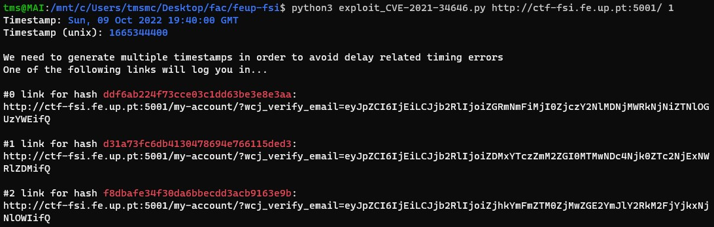

# Trabalho realizado na Semana #4

## Tarefas

### Tarefa 1

Depois de usar o comando **`env`** , todas as variáveis ​​de ambiente foram impressas no terminal e ao usar o comando **`env | grep PWD`** nos permitiu escolher uma única variável (**PWD**), pois existem várias variáveis ​​de ambiente.


Os comandos **`export`** e **`unset`** foram usados ​​por nós para definir uma variável de ambiente fictícia **"FSI"** com o valor **"123"** e excluí-la posteriormente.


### Tarefa 2

Compilamos e executamos o programa **`myprintenv.c`**. Em seguida, comentamos a instrução *`printenv()`* no processo filho e descomentamos a instrução *`printenv()`* no processo pai. Depois de compilar e correr o programa pela segunda vez, notamos que não havia diferença entre as variáveis de ambiente dos dois.


### Tarefa 3

Ao chamar ***`execve`***, sem a variável **`environ`**, não obtemos nada no terminal, o que significa que as variáveis ​​de ambiente não foram passadas.
Ao contrário, se mudarmos a chamada para uma usando a variável **`environ`** obteremos todas as variáveis ​​de ambiente com resultado semelhante ao da "Tarefa 1".


### Tarefa 4

A função ***`system()`*** executa um programa através da ***shell***, logo todas as variáveis ​​de ambiente do processo de chamada são passadas para o novo programa. A saída do programa são todas as variáveis ​​de ambiente do processo de chamada que foram passadas para o programa.


### Tarefa 5

Após compilar e executar o programa com e sem **permissões de *root*** verificamos que não houve diferenças no resultado. Portanto, todas as variáveis ​​de ambiente definidas no processo de ***shell*** entraram no processo filho Set-UID.

### Tarefa 6


## CTF

### **Flags**

- flag{CVE-2021-34646}
- flag{please don't bother me}

### **Resolução**

Depois de analisar o site e o seu código descobrimos o seguinte:

- Versão Wordpress: 5.8.1
- Plugins instalados: WooCommerce 5.7.1 e WooCommerce Booster Plugin 5.4.3
- Utilizadores: admin e Orval Sanford

Vulnerabilidade escolhida: Authentication Bypass\
CVE utilizado: CVE-2021-34646

**Utilização da CVE**:

- Indo a este site "https://www.exploit-db.com/exploits/50299" podemos encontrar indicações e um script que nos permitem ganhar acesso tendo apenas o id de um utilizador que é encontrado no seguinte endereço: "http://ctf-fsi.fe.up.pt:5001/wp-json/wp/v2/users/".
- Tendo o id de "admin" que é 1 podemos começar o nosso ataque.

```sh
## template de utilização do script: ./exploit_CVE-2021-34646.py https://target.com/ 1

python3 exploit_CVE-2021-34646.py http://ctf-fsi.fe.up.pt:5001/ 1
```

- Depois do script rodar são apresentados os seguintes links:   




- Depois de copiar um link dos gerados e verificarmos que temos acesso podemos visitar "http://ctf-fsi.fe.up.pt:5001/wp-admin/edit.php" onde podemos ver o post privado que contém a flag.


