## LOOGBOOK 5

### Task 0: Environment Setup

- Primeiro usamos o comando "sudo sysctl -w kernel.randomize_va_space=0" para desativar a randomização do inicio dos endereços da "heap" e da "stack".

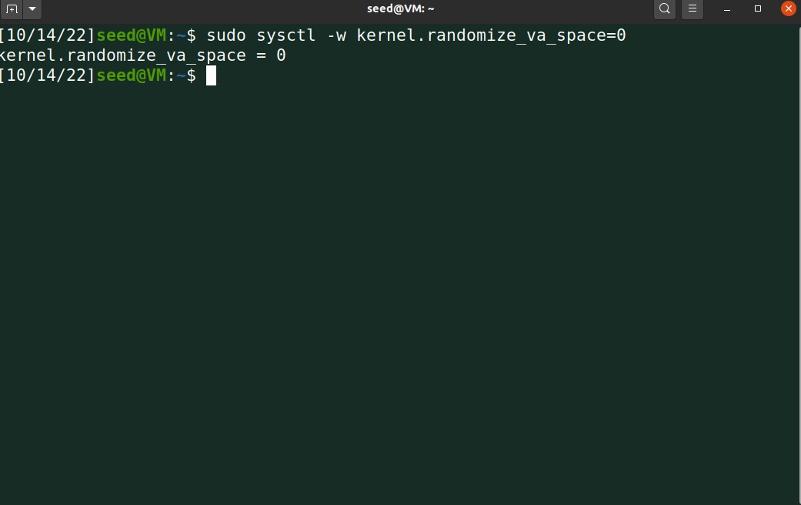

### Task 1: Getting Familiar with Shellcode

- Depois de compilarmos o Makefile presente na pasta "shellcode"
e corrermos o programa obtemos o seguinte: 

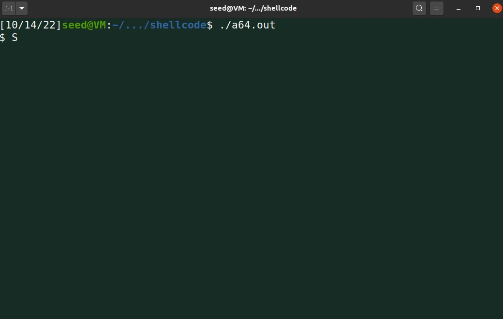

### Task 2: Understanding the Vulnerable Program

- Rodamos este código "gcc -DBUF_SIZE=100 -m32 -o stack -z execstack -fno-stack-protector stack.c" para compilar o "stack.c" com a StackGuard  e "non-executable stack protections" desligados 
- Usamos "sudo chown root stack " para mudar a ownership do programa para a root
- Usamos "sudo chmod 4755 stack" para ligar o "SET-UID"

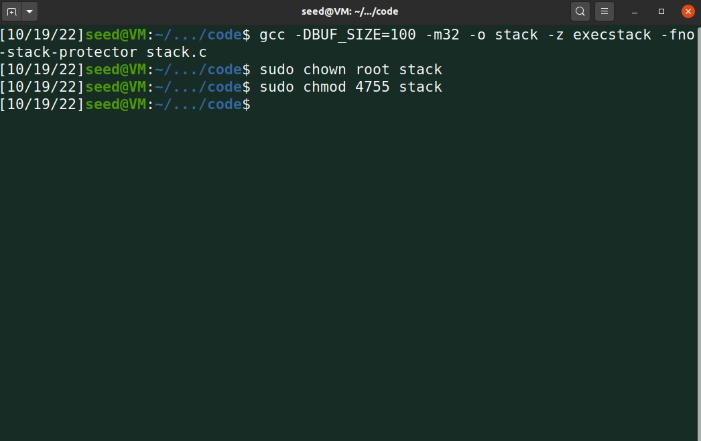

### Task 3: Launching Attack on 32-bit Program (Level 1)

- Rodando o seguinte código:

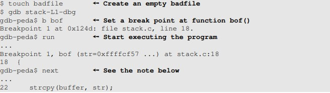

- Obtemos os dados necessários para gerar o exploit:

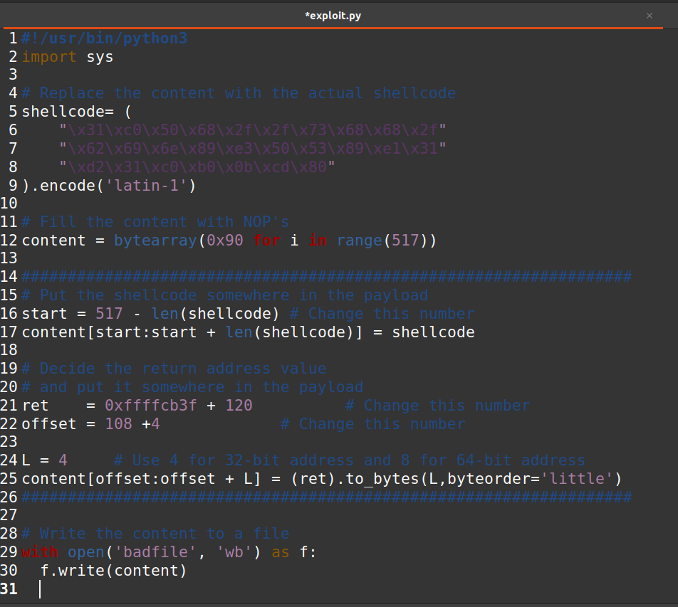

- Explicando o ataque:

1. Ingetamos a versão de 32 bits do shellcode
2. Inicializamos o ficheiro todo com NOPs 
3. Colocamos o código malicioso no final do payload
4. Com a informação que obtemos do "ebp" e "buffer" podemos criar um endereço suficientemente grande onde queremos retornar para encontrar os NOPs que nos levam ao shellcode

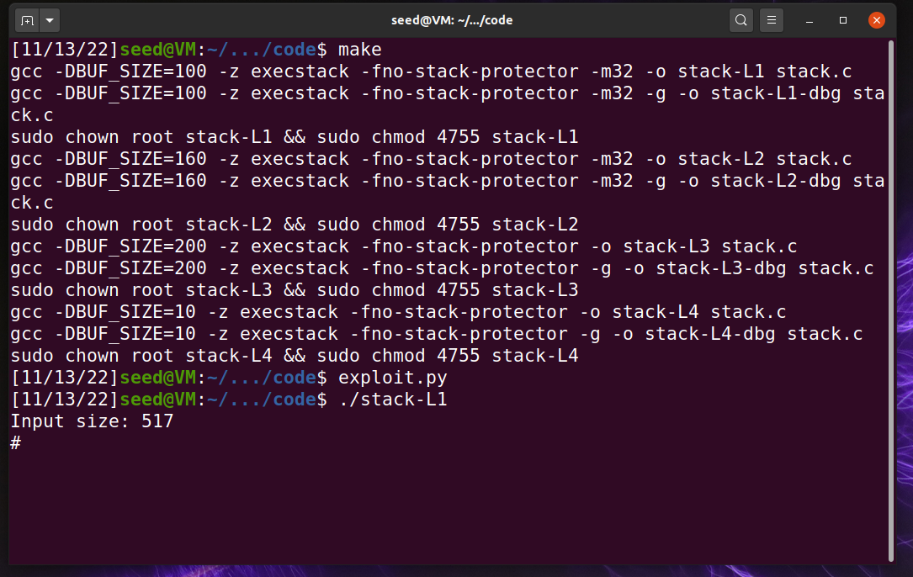

- Através deste exploit podemos aceder ao terminal e utilizá-lo:

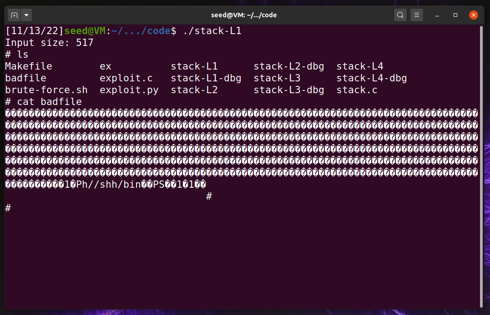

# CTF 3 D1

- Script usado na resolução

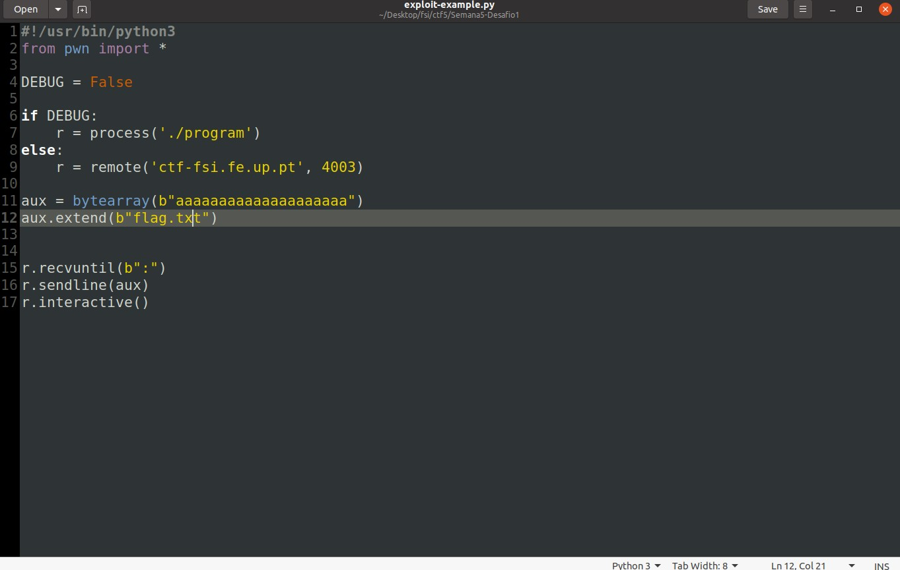

- Solução

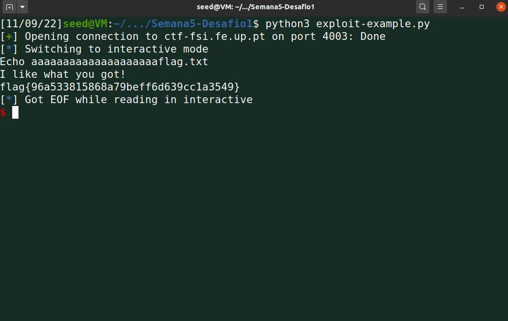

# CTF 3 D2

- Neste caso vamos usar o script de python fornecido com umas ligieiras alterações:
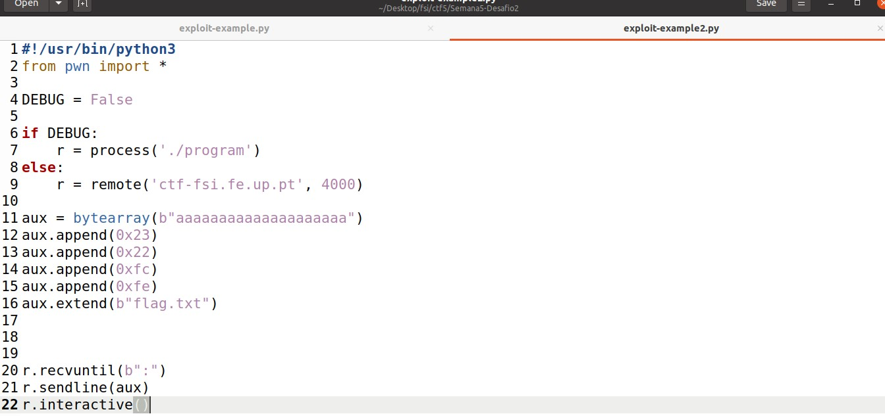

- Como no desafio 1 o buffer tem 20 bytes alocados o que faz com que ao dar scanf de 32 bytes haja overflow.
- Começamos por encher o buffer com 20 caracteres e nos restantes colocamos o endereço com a ordem inversa (por causa da stack) e o nome do ficheiro no fim.
- Ao rodar o scrip obtemos o seguinte:
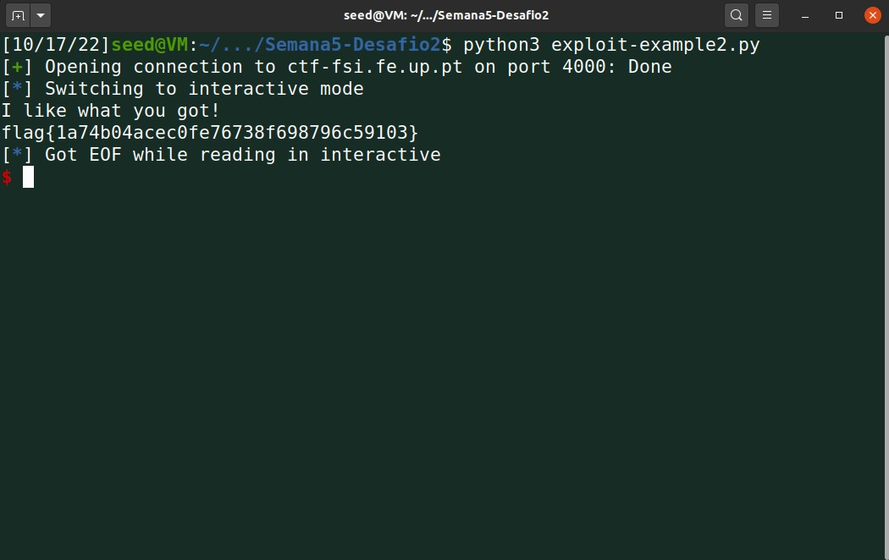

