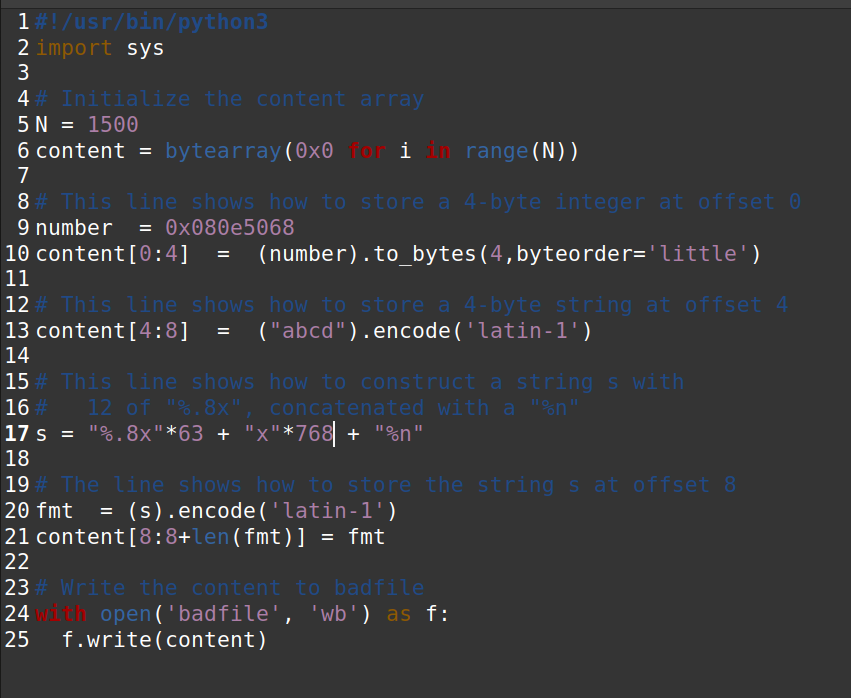
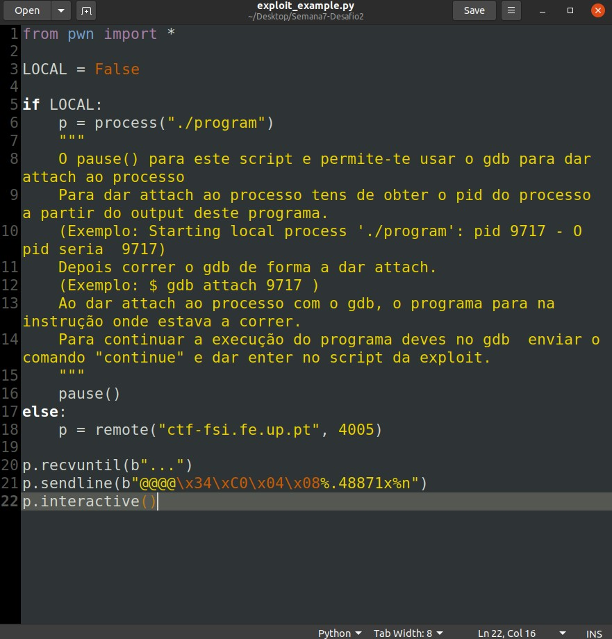

## LOOGBOOK7

## Task 1: Crashing the Program

Nesta tarefa é necessário parar o programa, fazendo uso da vulnerabilidade da função `printf()`. Ao dar como input através do ficheiro `badfile` gerado por `build_string.py`.
Ao escrever no ficheiro '%s', o prgrama irá parar uma vez que a memória não está reservada para a função `printf` e, portanto, pode não conter endereços em todos os locais referenciados.

## Task 2: Printing Out the Server Program’s Memory

### Task 2.A: Stack Data

De modo a obter os dados na stack é gerado, com `build_string.py`, um ficheiro `badfile` onde o primeiro `4-byte` é o array de inteiros no offset 0 (`0xbfffeeee`). Sendo assim, sabemos que conseguimos ler a stack quando o valor se repetir.
É necessário `'%.8x'` * 64 para poder obter o primeiro `4-byte` do ficheiro `badfile`.

### Task 2.B: Heap Data

Tendo realizado a tarefa anterior, em que acedemos ao primeiro `4-byte` com 64 *specifiers*, então sabendo que o endereço da mensagem secreta é 0x080b4008. Se colocarmos este valor no primeiro `4-byte` podemos obter a mensagem secreta que está no referido endereço usando `'%s'`, após 63 vezes `'%.8x'`:

Obtendo a mensagem secreta:

## Task 3: Modifying the Server Program’s Memory

### Task 3.A: Change the value to a different value

Sabendo o que ao ler dados usando os *specifiers* e colocando o enderço daquilo que se deseja no primeiro `4-byte` podemos aceder a esse valor e alterá-lo com `'%n'`.
Isto é, sendo o enderenço a alterar `0x080e5068` este pode ser modificado com: `"%.8x"*63 + "%n"`,

### Task 3.B: Change the value to 0x5000

Seguindo a lógica da tarefa anterior é possivél manipular o valor inserido no endereço alvo para um outro valor a desejar preenchendo o `badfile` com o número exato de bytes a colocar no endereço.
Sendo assim, usando a seguinte string `"%.8x"*63 + "x"*768 + "%n"` e usando o `%n` o valor é alterado para `0x5000`:

## CTF 7

### Task 1

#### Checksec
- No address randomization
- No regions in the memory with RWX permissions
- Cannaries present in the stack
- Architecture is x86
- Stack does not have execute permissions

- If we run gdb on "program" we can find the address of the flag buffer

- After that, we inserted a string where we passed first the address of flag and then a format string. This results of the address being written in memory and the format string, fetching the next value in memory, printing the contents pointed to by this address, the flag

### Task 2

#### Checksec
- No address randomization
- No regions in the memory with RWX permissions
- Cannaries present in the stack
- Architecture is x86
- Stack does not have execute permissions

- In this case the program is different because the flag in no longer in a buffer. It is still vulnerable but in a different way. We can use the format string vulnerability on line 14 to alter the value of key, giving us access to the bash.

- First we need to use gdb to fin key's address in the stack

- Then we need to force the number of bytes printed to be 0xbeef. We can do this using %n string formatting.

- Using this script we can start the attack

- Running the script

