# LOGBOOK8


## Task 1: Get Familiar with SQL Statements


Após executar os comandos indicados na ficha, para preparação da realização das tarefas, utilizamos o comando `SELECT * FROM CREDENTIAL WHERE NAME="Alice"` para obter os dados da Alice presentes na tabela.

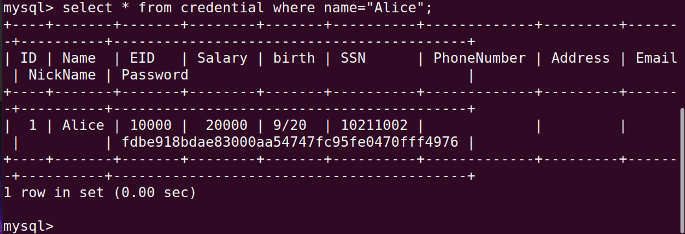


## Task 2: SQL Injection Attack on SELECT Statement

### Task 2.1: SQL Injection Attack from webpage

Nesta tarefa o objetivo é realizar login como administrador cujo o username é 'admin'.

Para isso, devido à vulnerabilidade presente é possível contornar a necessidade de palavra-passe colocando no user name o seguinte: `admin'; #`

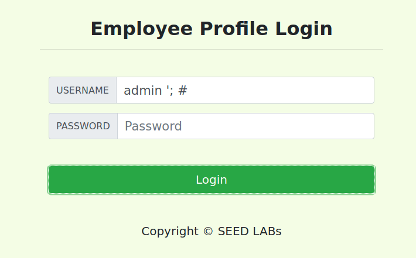

Obtendo o seguinte resultado:
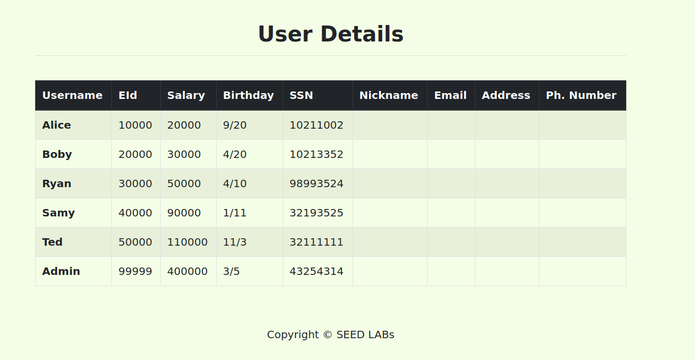


### Task 2.2: SQL Injection Attack from command line

Ao utilizar a linha de comando é possível enviar *HTTP requests* através de `curl`.
Ao escrever "`curl 'www.seed-server.com/unsafe_home.php?username=admin%27%20%23&Password=11'`", no qual "%27%20%23" representa "' #" na contrução da query obtemos:

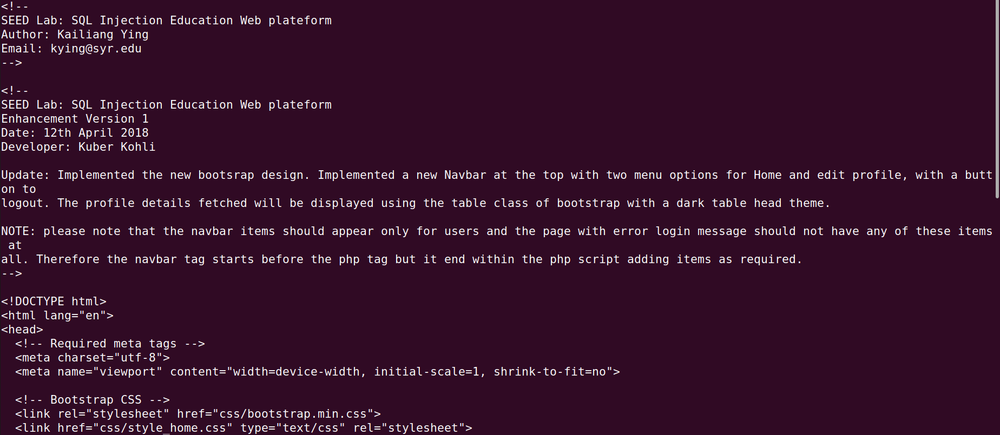

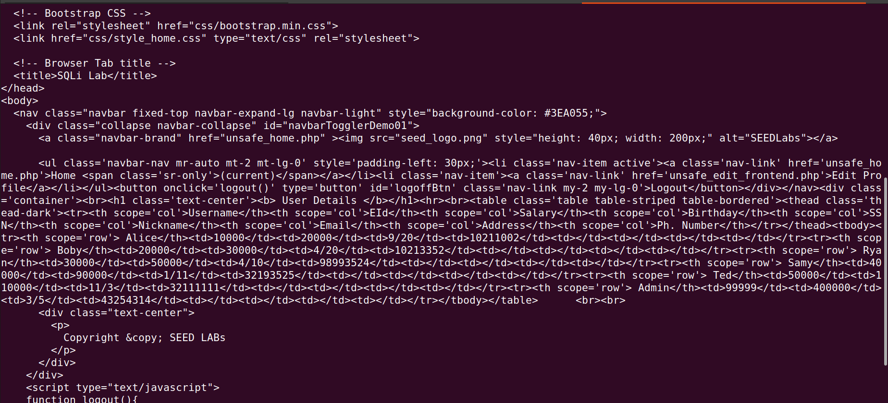


### Task 2.3: Append a new SQL statement

 Ao tentar executar um segundo comando SQL um similar com o seguinte ocorre:

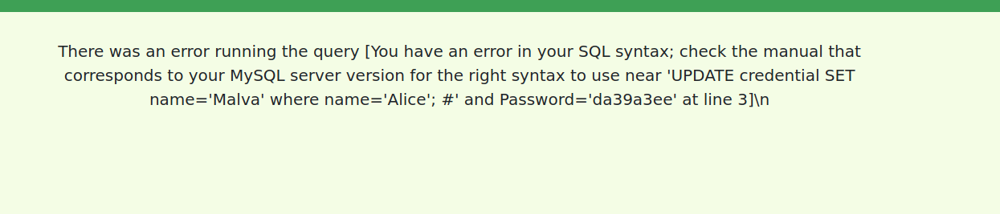

Isto dá se uma vez que na extensão do mysqli do PHP mysqli::query() API não aceita execurtar queries multiplas no servidor da base de dados. 

## Task 3: SQL Injection Attack on UPDATE Statement

### Task 3.1: Modify your own salary

Nesta tarefa, dando login sendo a Alice, queremos alterar o salário.
Podemos realizar este objetivo utilzando a vulnerabilidade presente na edição de perfil.
Em qualquer um dos paramentros podemos colocar o que desejamos que seja alterado e adicionar a instrução para aletarar também o salário.
Por exemplo, ao colocar no NickName "`Malva', salary=80000 where name='Alice'#`" 

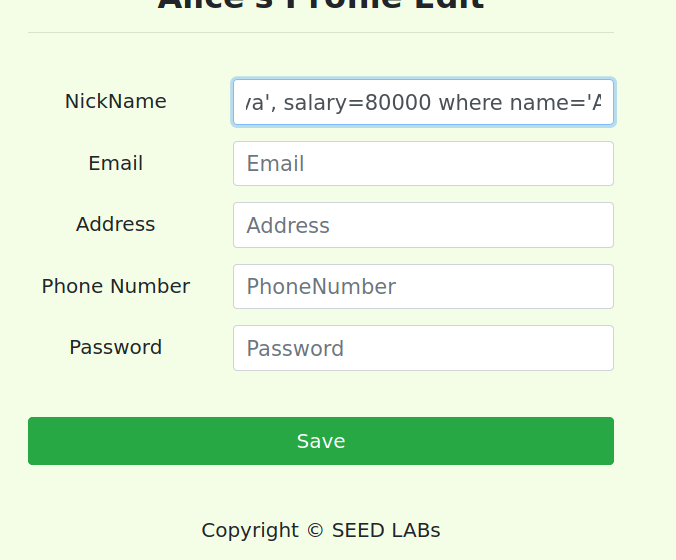

Obtendo assim:

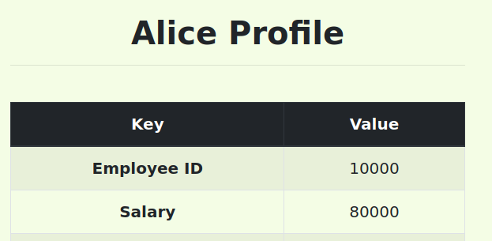


### Task 3.2: Modify other people’ salary

Semelhante à tarefa anterior, mas desta vez queremos atualizar o valor do salário de outro utilizador. Sendo assim, podemos utilizar o comando `Malva', salary=1 where name='Boby'#` ao editar o perfil da Alice.
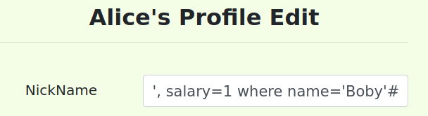

Esta ação irá realizar a alteração do salário do BOBY para 1:
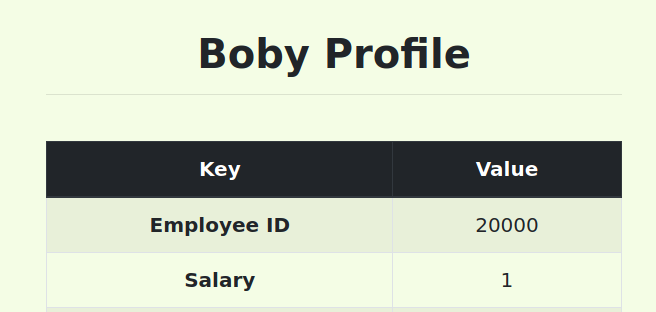

### Task 3.3: Modify other people’ password

Acedendo ao perfil da Alice, mais uma vez recorrendo à atualização dos seus dados no 'Edit Profile' podemos executar o comando `Malva', Password=sha1('novaPassword') where name='Boby'#` como já realizado no exercícios anteriores, tendo em atenção que a palavra-passe tem que se encriptada pela função `sha1()`:
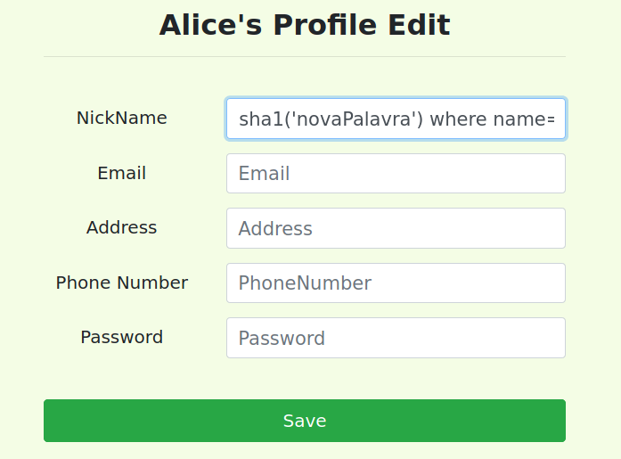

Assim, sendo cumpre-se o objetivo e é possível aceder ao perfil do Boby com a nova palavra-passse:
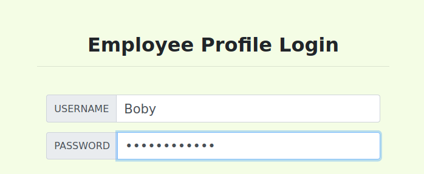
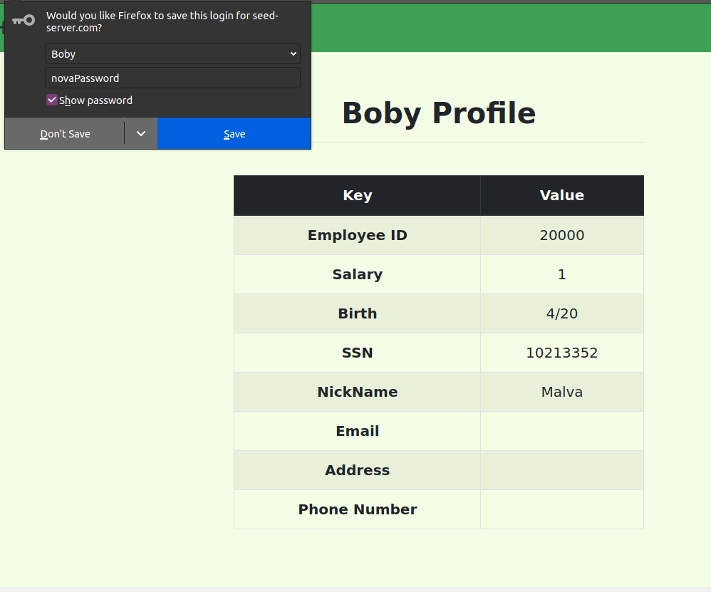
## CTF 8


## Challenge 1

- The first challenge is a white box attack since the source code is available for analysis.


- Since there is no input sanitization we can easily exploit this.

- The username to be used in the challenge is provided by the challenge guide on moodle. Without this information, we would need to architecture a more general attack that would allow us to bypass not only the value of the password but also the username value.

- We can bypass authentication of the admin username by performing a SQL Injection. Exploiting the point that we mentioned earlier


```php
username: admin
password: ' OR ''=' 
```

- After we try to login with this credentials we obtain the flag.


## Challenge 2
