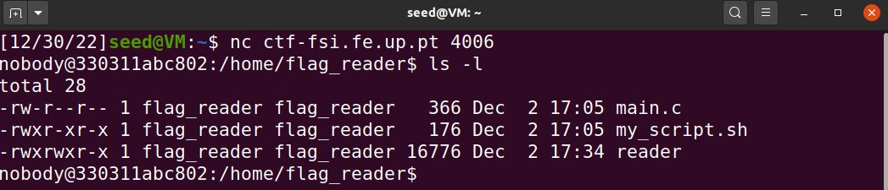
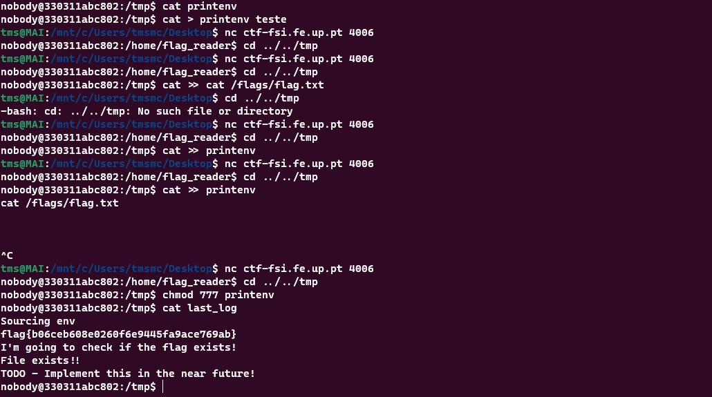

# BritishPunctuality

- First we need to see what the directory contains
  
  

- using cat command on "main.c" we can se that it tries to access "flags/flag.txt" and that "my_script.sh" will enter aan if section when there is a "env" file in "/tmp/

- By navigating to "/tmp/" we find a file called "last_log" that is generated every minute by a "cron" service and seems to contain output from both "my_script.sh" abd "main.c" and it has permissions since it writes "File Exists".

- After some testing we find that we can change environment variables by altering the contents of "env" so, we write to it echo "PATH=/tmp:$PATH", with this we can run our own version of "printenv". We grant all permissions to our "printenv" by running "chmod777 printenv", and write inside it "cat/flags/flag.txt".

 **Changed from VM to WSL environment because I thought that was the reason I was losing shell(tms stands for tomas)**

- Execution:

